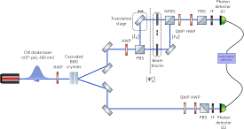
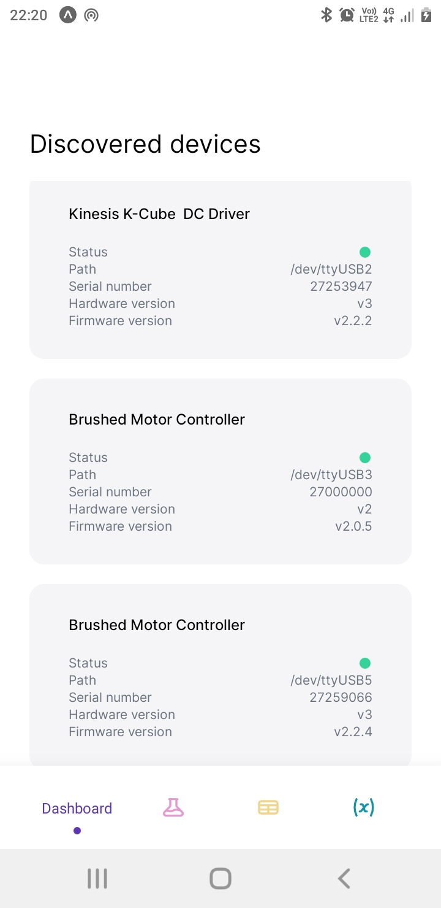
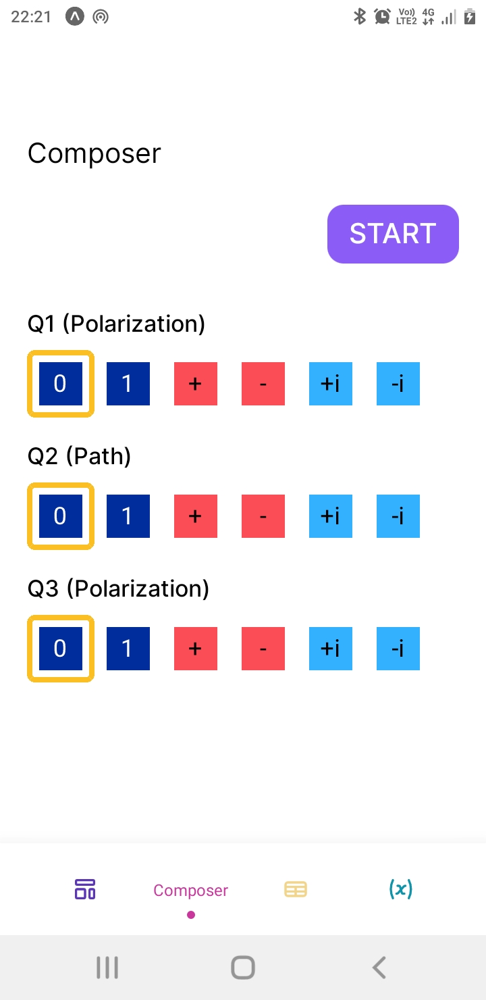
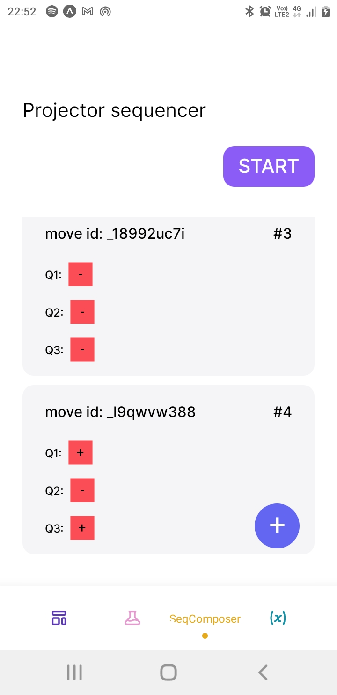
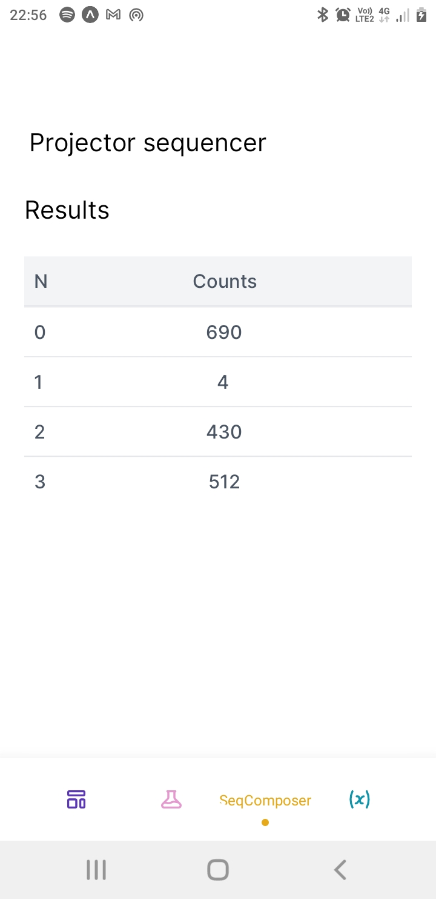
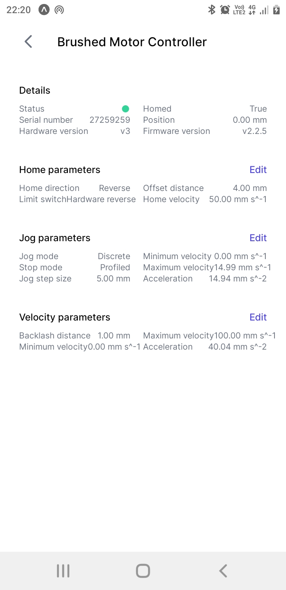
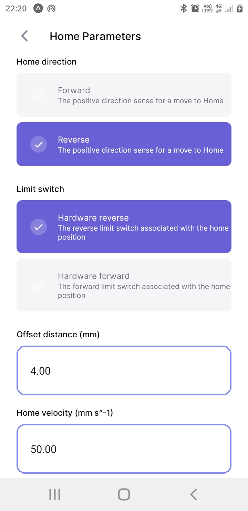
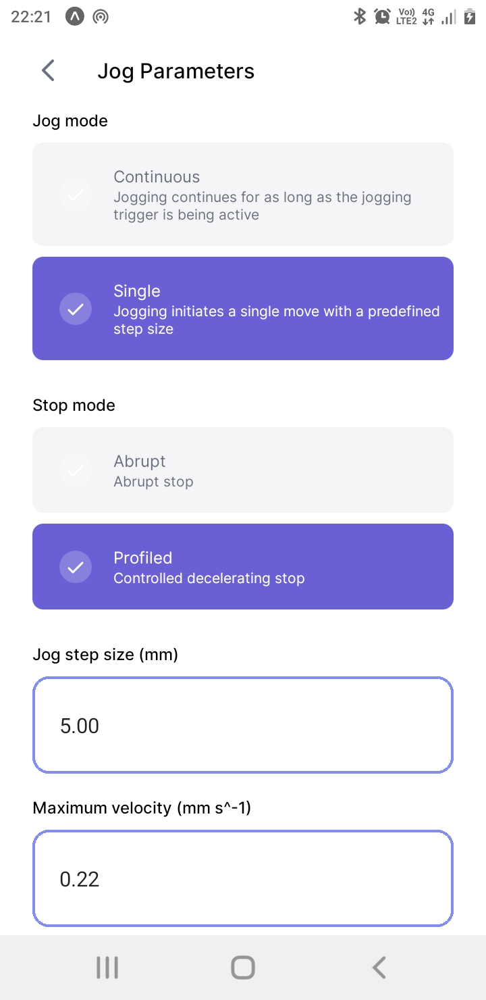
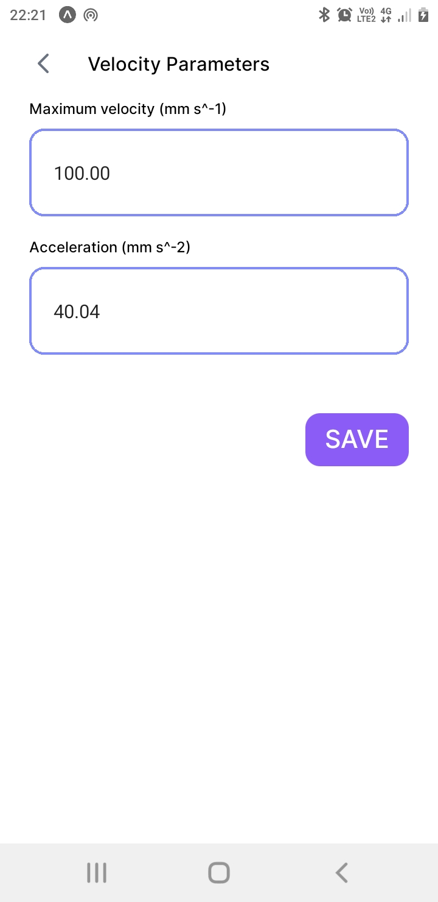
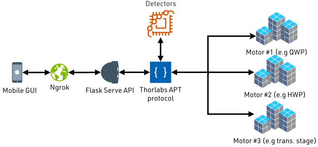

# Control code for my experimental setup realizing a hyperentangled photonic state.

During my masters degree, I built a photonic experiment realizing a three-photon
hyperentangled states (See chapter 5 from my thesis for more details, [here](https://scholar.sun.ac.za/bitstream/handle/10019.1/124708/skosana_quantum_2022.pdf?sequence=1)). Schematically, it looks something like this.

<div>
  
</div>

<br/>

For an experiment of that kind, manually performing measurements, by turning the various dials on the components (_i.e._ Half/Quarter wave plates, etc.) during an experiment, can be a bit tedious and prone to human error (A Mach-Zach interferometer can stop working because you sneezed near it). Some optical components can be interfaced with a motor, from which you can do the dial-turning. Unfortunately, this can still be a bit error-prone. Luckily, ThorLabs motors have a low level communication [protocol](https://www.thorlabs.com/software/apt/APT_Communications_Protocol_Rev_15.pdf), and a functional implementation of this protocol in python exists [thorlabs-apt-protocol](https://github.com/yaq-project/thorlabs-apt-protocol). The latter is straight forward to use:

 ```python
import thorlabs_apt_protocol as apt
import serial

# grab motor connected to USB port 0
z_stage = serial.Serial("/dev/ttyUSB0", 115200, rtscts=True, timeout=0.1)
z_stage.rts = True
z_stage.reset_input_buffer()
z_stage.reset_output_buffer()
z_stage.rts = False

position = PROJ_ONE_POS
z_t_stage.write(
    apt.mot_move_absolute(
        source=source,
        dest=dest,
        chan_ident=chan_ident,
        position=int(np.ceil(position * ENC_CNT)),
    )
)
```
The above code snippet grabs the translation stage connected to `ttyUSB0`, and
tells it to move to position `PROJ_ONE_POS`, which moves the beam blocks in the
experiment to block one of the paths in the Mach-Zehnder interferometer (see experiment schematic), which effectively performs a projective z-basis measurement on the hyperentangled photonic state. With this, I wrote modularize code that allowed one to specify other measurement procedures (Y, X basis measurements etc) that were relavant to my experiment. This [modularized code](https://github.com/Unathi-Skosana/remote-kdc-101/blob/main/server/src/app.py) is served by a [Flask](https://flask.palletsprojects.com/en/2.1.x/) application running on a Raspiberry Pi, on which the motors are connected.

Next, we need to collect the results of the measurements described above. The single
photon detectors in the schematic, collect photons from the experiment and output to a counter module that counts how many photons are detected, and also how many are coincident with each other or detected simultaneously within some time window (correlated photons); this module is often called a coincidence counting module (You can see it's description [here](https://doi.org/10.1119/1.3116803)). It's core component is a field-programming gate array (FPGA), which in the experiemnt is also connected to the same Raspiberry Pi as the motors. Similarly, we can read the output from FPGA connected through a USB port to Raspberry Pi:

```python
import serial
import io
import serial.tools.list_ports
import numpy as np
import time

# Rate at each port is read from the FPGA
rate = 0.1

# Time interval of collections in seconds
period = 10

with serial.Serial('/dev/ttyUSB0', 19200, timeout=1, stopbits=serial.STOPBITS_ONE) as ser:
    while True:
        # [A ,B, AB, AB', BB', .... ]
        # where A are counts from detector A
        # and AB are coincidence between detectors A and B
        accum = [0, 0, 0, 0, 0, 0, 0, 0]
        start_time = time.time()
        for i in range(0, 10 * period):
            b = ser.read(41)
            s = np.frombuffer(b, dtype=np.uint8)
            y = np.unpackbits(s) # Turns bytes into bit array.
            y = y[:-8]           # Remove last 8 bits - this is the termination byte
            y = (np.split(y, 8))
            z = np.sum(np.packbits(y,1) * (1,128,256,384,512), 1)
            accum += z
            time.sleep(rate)
        print("--- time elapsed: %s seconds ---" % (time.time() - start_time))
        print(accum)
```

The variable `accum` accumulates single counts (counts from each detector), double counts
(coincidence counts from two detectors) and so on, as the results of the measurements. The snippet above is invoked at the end of each special move in the Flask server, and the server responds to the requester with counts gathered from that particular move.

Lastly, instead of having to directly invoke the API served by Flask, I made a tiny
react-native mobile graphical user interface that consumes the said API, and leaves the user to just pressing buttons on a mobile screen to specify any measurement procedure and get its results:

<div>
  
 
  
 
</div>

<br />

Furthermore, I extended the API, to allow the GUI to change some of the settings on the motors such as home positioning, velocity, jogging step size, etc:

<div>
  
  
 
  
</div>

<br/>

On boot, the Raspberry Pi creates a tunnel URL for the Flask server running locally, through the tunnel URL the GUI can access the said API. The entire work flow described thus far can be schematically represented as:

<div>
  
</div>

## Credits
- [thorlabs-apt-protocol](https://github.com/yaq-project/thorlabs-apt-protocol)
- [An improved vector graphics library for illustrations of optics experiments](https://github.com/amv213/ComponentLibrary)
